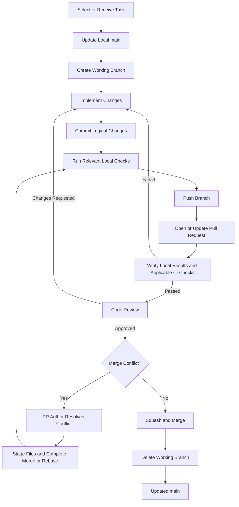

# HanCode Git Workflow

This document defines the Git workflow used within the **HanCode team repository**. Its purpose is to ensure that all team members follow the same development, review, and integration process.

---

## 1. Selected Git Workflow and Rationale

Our team uses a combination of the following workflows:

- **Centralized Workflow**
- **Feature Branch Workflow**
- **GitHub Flow**

All team members collaborate through a single shared **team repository**. Each feature, bug fix, or documentation task is developed on a separate short-lived branch rather than directly on `main`. Completed work is integrated into `main` through a Pull Request (PR), verification, and code review.

Our eight-member team works on separate parts of the Currency System and integrates them with code from other teams.

This approach is suitable for our project because it:

- allows multiple team members to work in parallel without directly interfering with one another,
- keeps unfinished work isolated from `main`,
- provides a clear review process before integration,
- checks changes locally before merge and uses automated build and test checks when available,
- keeps the `main` branch stable and easy to understand.

The team repository is the center of collaboration. The workflow described in this document focuses on how individual team members contribute to that repository.

---

## 2. Branch Strategy

### 2.1 `main`

`main` is the stable integration branch of the team repository.

Rules:

- `main` should always contain integrated and reviewed work.
- Normal development must not be performed directly on `main`.
- New working branches must be created from the latest `main`.
- Changes must enter `main` through Pull Requests.
- Direct pushes and force pushes to `main` are prohibited.

### 2.2 `feature/*`

Used for implementing new features.

Examples:

```text
feature/currency-system
feature/reward-system
feature/save-load
```

Lifecycle:

1. Create the branch from the latest `main`.
2. Implement the feature and commit logical changes.
3. Push the branch to the team repository.
4. Open a Pull Request to `main`.
5. Merge after all required checks and review conditions are satisfied.
6. Delete the branch after the PR is merged.

### 2.3 `fix/*`

Used for bug fixes or corrections to existing behavior.

Examples:

```text
fix/currency-negative-balance
fix/save-load-error
```

The lifecycle is the same as for `feature/*` branches.

### 2.4 `docs/*`

Used for documentation-only changes.

Examples:

```text
docs/team-document
docs/git-workflow
```

The lifecycle is the same as for other working branches.

### 2.5 Branch Lifetime

Working branches should be short-lived and focused on one task or one coherent change. Unrelated work should not be mixed into the same branch.

---

## 3. Commit Rules

### 3.1 Commit Scope

Each commit should represent **one logical change**.

Good examples:

```text
feat: add CurrencyBalance class
fix: reject invalid currency deductions
test: add unit tests for CurrencyBalance
docs: update team roles
```

Avoid commits that mix unrelated changes or contain several independent tasks at once.

### 3.2 Commit Message Format

The team follows a simplified **Conventional Commits** format:

```text
<type>: <short description>
```

Allowed types:

| Type | Purpose |
|---|---|
| `feat` | Add a new feature |
| `fix` | Fix a bug |
| `refactor` | Restructure code without changing intended behavior |
| `test` | Add or modify tests |
| `docs` | Modify documentation |
| `chore` | Maintenance, configuration, or other non-feature work |

Examples:

```text
feat: add reward system
fix: prevent negative currency balance
refactor: simplify purchase validation
test: add CurrencyBalance unit tests
docs: update Git workflow
```

Commit descriptions should be short, specific, and written in English so that the purpose of the change is clear from the history.

---

## 4. Pull Request and Code Review Rules

### 4.1 When to Open a Pull Request

A Pull Request should normally be opened when the intended task is complete and ready for review.

Before opening a PR, the author should verify that:

- the intended task has been implemented,
- the project builds successfully for code changes,
- available relevant tests pass and the affected behavior has been checked,
- documentation changes have been checked for content, links, and rendered Markdown,
- unnecessary debug code has been removed,
- the branch does not contain unrelated changes.

A **Draft Pull Request** may be opened earlier when early feedback or discussion is useful.

### 4.2 Pull Request Description

Each Pull Request should clearly explain:

- **What changed**
- **Why it changed**
- **How it was tested**

PR descriptions should be written in English and include the verification commands and results, or the manual checks performed.

### 4.3 Review and Approval Conditions

A Pull Request may be merged only when all of the following conditions are satisfied:

- relevant local checks pass and their results are recorded in the PR,
- applicable required CI checks pass once CI is configured,
- at least **one other team member** approves the PR,
- unresolved review comments have been addressed,
- no unresolved merge conflict remains.

The PR author's own approval does not count toward the required approval.

Before CI is available, the author must build code changes and run the available relevant tests. Behavior not covered by automated tests must be checked manually. Documentation-only changes require checks of the content, links, and rendered Markdown, including diagrams. Reviewers must check the recorded results before approval.

Reviewers should focus on:

- correctness of the implementation,
- consistency with the agreed design,
- logical errors,
- possible regressions,
- readability and maintainability.

Automated checks should handle mechanical validation such as build and test execution whenever possible.

### 4.4 Direct Pushes to `main`

Direct pushes to the team repository's `main` are prohibited.

Upstream synchronization and related conflict resolution must be performed on a separate working branch. The changes must enter the team repository's `main` through a PR that meets the verification and review conditions in Section 4.3.

These operations are handled by the **Dev Lead**, or by another team member explicitly delegated by the Dev Lead when the Dev Lead is unavailable or unable to perform the resolution.

PRs to the upstream course repository must follow the course's review and merge rules, including review by at least one other team.

---

## 5. Merge Strategy

### 5.1 Default PR Merge Method: Squash and Merge

All normal Pull Requests from working branches into `main` use **Squash and Merge**.

A working branch may contain several development commits, but they are combined into one logical commit when merged into `main`.

Example:

```text
feature/currency-system
  ├─ feat: add CurrencyBalance class
  ├─ fix: correct validation logic
  ├─ test: add CurrencyBalance tests
  └─ refactor: simplify deduction logic
```

After Squash and Merge:

```text
main
  └─ feat: implement currency balance system (#PR)
```

This keeps the `main` history concise and organized around completed tasks or features.

### 5.2 Rebase Rules

Rebase may be used **only on a personal working branch**.

A developer may rebase a personal branch onto the latest `main` when they want to update the branch before integration.

Example, assuming `feature/currency-system` already exists and is used only by you. Commit or stash local changes before starting:

```bash
git switch feature/currency-system
git status --short
# Continue only if the working tree and index are clean.
git fetch origin
git rebase origin/main
```

Rules:

- Rebase must not be performed on `main`.
- Rebase must not be performed on a branch that is actively shared by multiple developers.
- History rewriting on `main` is prohibited.
- Force pushes to `main` and shared branches are prohibited.
- If a personal branch has already been pushed and must be updated after a rebase, `git push --force-with-lease` may be used only on that personal branch.
- If the lease is rejected, fetch and inspect the remote changes before deciding how to proceed. Do not retry with `--force`.

If a rebase stops with a conflict, resolve the affected files, stage them with `git add`, and run `git rebase --continue`. Repeat until the rebase finishes. Use `git rebase --abort` to cancel the rebase.

### 5.3 Regular Merge

Regular merge commits are not used for normal internal Pull Requests. Internal PRs use **Squash and Merge**.

When synchronizing with the upstream repository, preserving upstream history may require a regular merge depending on the synchronization situation. Such integration is handled under the upstream conflict rules below.

### 5.4 Merge Conflict Resolution

#### Individual Pull Request Conflicts

Merge conflicts in an individual Pull Request are the responsibility of the **PR author**.

The PR author must:

1. update the branch with the latest required changes,
2. resolve the conflict,
3. stage the resolved files and complete the merge commit or continue the rebase until it finishes,
4. repeat the relevant local checks described in Section 4.3,
5. push the resolved branch to update the existing PR,
6. have the updated changes reviewed before merge.

If the conflict involves code primarily maintained by another member, the PR author may coordinate with that member, but the PR author remains responsible for completing the resolution.

#### Upstream Synchronization and Upstream PR Conflicts

Merge conflicts that occur during:

- synchronization between the upstream repository and the team repository, or
- integration of the team repository into the upstream repository

are primarily the responsibility of the **Dev Lead**.

If the Dev Lead is unavailable or unable to resolve the conflict, the Dev Lead may delegate the task to another team member. The delegated member then performs the resolution on behalf of the team.

The resolution must be completed on a working branch and pass the verification and review conditions in Section 4.3 before it enters the team repository's `main`. Code changes must be built and tested again; documentation changes must be checked for content and rendering.

---

## 6. Overall Development Workflow

The standard workflow for a team member is:

1. Select or receive a task.
2. Update the local `main` branch.
3. Create a new working branch from the latest `main`.
4. Implement the task.
5. Commit logical changes using the agreed commit format.
6. Run the relevant local checks.
7. Push the working branch to the team repository.
8. Open a Pull Request to `main`.
9. Record the local verification results in the PR and wait for any applicable required CI checks.
10. Receive code review from at least one other team member.
11. If changes are requested, commit the revisions, repeat the checks, and push to the same branch for review.
12. Resolve any merge conflicts, complete the merge or rebase, and repeat verification and review.
13. After all checks pass and at least one approval is received, use **Squash and Merge**.
14. Delete the completed working branch.

### Workflow Diagram



---

## 7. Summary of Team Rules

- All team members collaborate through the shared team repository.
- Development is performed on short-lived `feature/*`, `fix/*`, or `docs/*` branches.
- Direct pushes to `main` are prohibited.
- Each commit should represent one logical change.
- Commit messages follow the `<type>: <description>` format.
- Every change to the team repository's `main` must go through a Pull Request.
- At least one other team member must approve a PR before merge.
- Relevant local checks must pass and be recorded in the PR before merge. Applicable required CI checks must also pass once configured.
- Normal PRs use **Squash and Merge**.
- Rebase is allowed only on personal working branches.
- Rebase and force push on `main` are prohibited.
- Individual PR conflicts are resolved by the PR author.
- Upstream synchronization and upstream PR conflicts are handled by the Dev Lead, or by a team member explicitly delegated by the Dev Lead.

